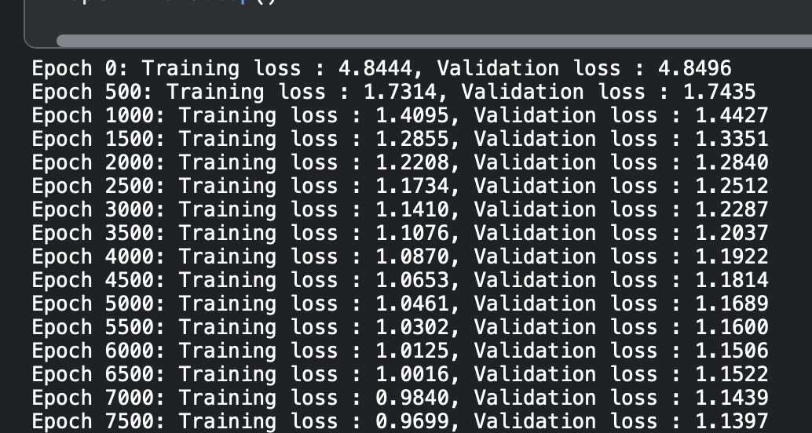

# bigram-llm-scratch

PyTorch implementation of Bigram Large Language Models, from scratch.
The model trains on a piece of text and generates new text similar to it.<br/>
Trainable parameters : <b>25.37 million</b><br/>
Vocabulary size : <b>104</b>

## Files
- ```train.py``` - Defines the model architecture and hyperparameters and runs training loop.
- ```app.py``` - Contains the web application made using Flask, which prompts user to enter maximum character length of the generated text, and gives required output.
- ```app_model.py``` - Defines the same model architecture to be used for instantiation and inference by the web app.
- ```notebooks/``` contains Jupyter Notebook having step-by-step implementation and training of the code.
- ```data/``` contains the raw text file on which the model is trained.

## Attention mechanism


## Screenshots
- Index Page:<br/>


- Result Page:<br/>


- Training and validation loss: <br/>



## References 
- Paper : [Attention Is All You Need](https://arxiv.org/abs/1706.03762) (Vaswani et al., 2017)
    -  Architecture: <br/>  

